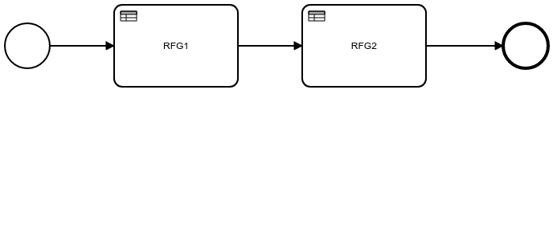

# drools ruleflow-group example

## Execution

This example shows how to order rules execution

## Running

mvn -s settings.xml -Prh-hosted-repo clean test

## Credits

- Diagram screenshot created with [bpmn-to-image](https://github.com/bpmn-io/bpmn-to-image/)
- diagram.svg created with https://bpmn.io/
